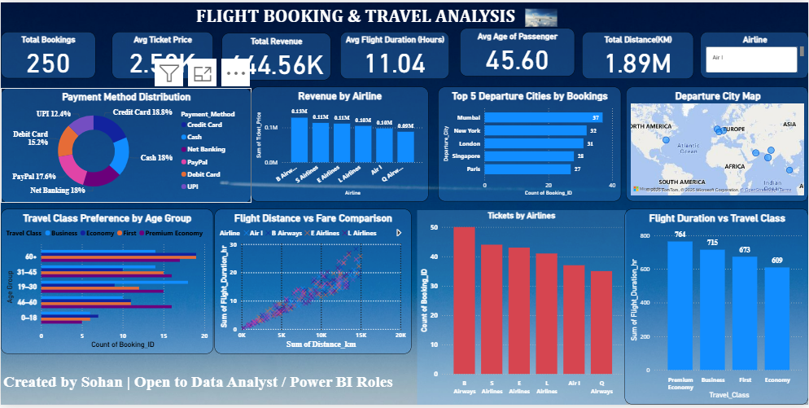

# ✈️ Flight Booking & Travel Analysis – Power BI Dashboard

  

---

## 📌 Project Overview
This repository contains an interactive **Power BI dashboard** built to analyze flight booking data, uncovering insights about travel behavior, revenue performance, and booking trends. The report transforms raw flight booking data into meaningful business insights using professional visualization techniques and DAX-based calculations.

---

## 🔍 Key Insights Included
- **Total Bookings, Total Revenue & KPI Metrics**
- **Ticket Volume by Airlines**
- **Top 5 Departure Cities**
- **Travel Class Distribution**
- **Passenger Age Group Segmentation**
- **Payment Method Preference Analysis**
- **Distance vs Ticket Price (Scatter Plot)**
- **Geographic Map of Bookings (Departure Cities)**
- **Custom Tooltips & Interactive Slicers**

---

## 🛠 Tools & Technologies Used
- **Microsoft Power BI Desktop**
- **DAX (Measures & Calculated Columns)**
- **Data Modeling Concepts**
- **Visualization & Dashboard UI Design**
- **Bing Maps for Geospatial Analysis**
- **Analytical Storytelling Techniques**

---

## 📊 Dashboard Highlights
- Clean, modern design with consistent color theme  
- Insightful KPI cards summarizing business performance  
- Interactive filters for dynamic exploration  
- Age group segmentation created via DAX logic  
- Visualization variety: bar charts, donut charts, map view, scatter plot  
- Detailed revenue and booking breakdowns  
- Fully optimized layout suitable for presentations and analytics reporting  

---

---

## 🎯 Purpose of This Project
This project demonstrates practical skills in:
- Data Analytics  
- Power BI Development  
- Business Intelligence Reporting  
- KPI Design & Segmentation  
- Data Visualization & Storytelling  

The dashboard is designed to resemble a **real-world airline analytics report**, making it suitable for portfolio display and job applications.

---

## 👨‍💻 Created By
**Sohan**  
Power BI Developer & Data Analyst  
*Open to opportunities in Business Intelligence, Analytics, and Reporting.*

---
